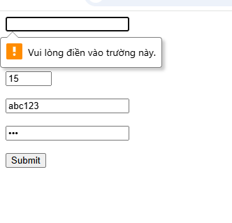

## Câu A1 — Input Types

1. type="email" → Ô nhập text, tự kiểm tra có @ → Dùng cho form đăng ký  
2. type="password" → Ô nhập ẩn ký tự → Dùng cho đăng nhập  
3. type="number" → Ô nhập số, có nút tăng giảm → Dùng nhập số lượng sản phẩm  
4. type="tel" → Ô nhập số điện thoại → Dùng nhập số điện thoại giao hàng  
5. type="date" → Chọn ngày từ lịch → Dùng chọn ngày giao hàng  
6. type="range" → Thanh kéo → Dùng lọc giá sản phẩm  
7. type="checkbox" → Ô tick chọn nhiều → Dùng chọn nhiều sản phẩm  
8. type="radio" → Chọn 1 trong nhóm → Dùng chọn phương thức thanh toán  
9. type="file" → Chọn file → Dùng upload ảnh sản phẩm  
10. type="search" → Ô tìm kiếm → Dùng tìm sản phẩm


## Câu A2 — Validation Attributes

1. required (để trống)      
→ Không submit được vì bắt buộc nhập dữ liệu  

2. email = "abc"  
→ Không submit vì sai định dạng email (thiếu @)  

3. number = 15 (max=10)  
→ Không submit vì vượt giá trị max  

4. pattern="[0-9]{10}" với "abc123"  
→ Không submit vì không đúng 10 chữ số  

5. password minlength=8 với "123"  
→ Không submit vì chưa đủ 8 ký tự  

### So sánh:

Kết quả thực tế giống dự đoán, trình duyệt chặn submit và báo lỗi.

## Câu A3 — Accessibility

### 1. Tại sao `<label for="email">` quan trọng?
- Screen reader sẽ đọc nội dung label khi focus vào input → người dùng biết đang nhập gì  
- Click vào label sẽ focus vào input → dễ thao tác hơn  
- Tạo liên kết rõ ràng giữa label và input → tăng tính ngữ nghĩa  

---

### 2. Khi nào dùng `<fieldset>` + `<legend>`?
- Dùng khi có nhiều input liên quan cùng một nhóm  

**Ví dụ:**
```html
<fieldset>
  <legend>Phương thức thanh toán</legend>

  <input type="radio" id="cod" name="pay">
  <label for="cod">Thanh toán khi nhận hàng</label>

  <input type="radio" id="bank" name="pay">
  <label for="bank">Chuyển khoản</label>
</fieldset>

### 3. aria-label dùng khi nào? Tại sao KHÔNG nên dùng khi đã có  `<label>`?

- Dùng khi phần tử **không có text hiển thị** nhưng vẫn cần mô tả cho screen reader  
- Thường áp dụng cho icon, button không có chữ  

**Ví dụ:**
```html
<button aria-label="Tìm kiếm">🔍</button>


## Câu A4 — Media

### 1. loading="lazy" là gì? Cải thiện gì? Khi nào KHÔNG nên dùng?
- `loading="lazy"` giúp ảnh chỉ tải khi sắp xuất hiện trong màn hình (viewport)  
- Giảm thời gian tải ban đầu → tăng tốc độ trang  
- Tiết kiệm băng thông  

**KHÔNG nên dùng khi:**
- Ảnh quan trọng ở đầu trang (hero banner, ảnh sản phẩm chính)  
- Ảnh cần hiển thị ngay lập tức  

---

### 2. Tại sao nên dùng nhiều `<source>` trong `<video>`?
- Trình duyệt khác nhau hỗ trợ format khác nhau  
- Đảm bảo video chạy được trên nhiều trình duyệt  

**Format phổ biến:**
- MP4  
- WebM  
- OGG  

---

### 3. Thuộc tính `alt` trên `` dùng để làm gì?
- Mô tả nội dung ảnh cho screen reader  
- Hiển thị khi ảnh bị lỗi  
- Hỗ trợ SEO  

**Ví dụ alt:**

- Ảnh sản phẩm iPhone 16  
```html


## Câu A5 — So sánh `<figure>` vs ``

### Khi nào dùng Cách 1 (``)?
- Dùng khi ảnh đơn giản, không cần chú thích thêm  
- Ảnh chỉ mang tính hiển thị cơ bản  

**Ví dụ:**
- Ảnh icon sản phẩm trong danh sách  
- Ảnh avatar người dùng  

---

### Khi nào dùng Cách 2 (`<figure>` + `<figcaption>`)?
- Dùng khi ảnh cần mô tả, chú thích hoặc thông tin đi kèm  
- Nội dung caption có ý nghĩa liên quan trực tiếp đến ảnh  

**Ví dụ:**
- Ảnh sản phẩm kèm tên và giá  
- Ảnh bài blog kèm mô tả nội dung hoặc nguồn ảnh  

---

### So sánh:
- ``: đơn giản, chỉ hiển thị ảnh  
- `<figure>`: có cấu trúc rõ ràng hơn, nhóm ảnh + chú thích  


### Phan C

  ## Câu C1 — Debug Form

**Dòng 2 (Tên):**  
Chưa có label liên kết với input → không đảm bảo accessibility  
→ Sửa: thêm `<label for="name">` và `id="name"`, đồng thời thêm `required`  

---

**Dòng 4 (Email):**  
Input email có placeholder nhưng không có label → screen reader khó hiểu  
→ Sửa: thêm `<label for="email">` và `required`  

---

**Dòng 6-7 (Password):**  
Hai ô password không có label và không có ràng buộc độ dài  
→ Sửa: thêm label cho từng ô + `minlength="8"` + `required`  

---

**Dòng 9 (Phone):**  
Dùng sai type (`text` thay vì `tel`), có giá trị mặc định không cần thiết, không kiểm tra định dạng  
→ Sửa: đổi sang `type="tel"`, bỏ `value`, thêm `pattern="[0-9]{10}"` và `required`  

---

**Dòng 11 (Select):**  
Thẻ `<select>` không có label → không rõ ý nghĩa  
→ Sửa: thêm `<label for="city">` và `id="city"`  

---

**Dòng 15 (Điều khoản):**  
Chỉ có label nhưng không có checkbox → không thể tương tác  
→ Sửa: thêm `<input type="checkbox">` và `required`, liên kết với label bằng `for`  

---

**Tổng kết lỗi:**
- Thiếu label cho nhiều input  
- Thiếu thuộc tính validation (`required`, `minlength`, `pattern`)  
- Dùng sai type input  
- Thiếu checkbox cho điều khoản  
- Không đảm bảo accessibility


## Câu C2 — Thiết kế chiến lược Validation

### 1. Pattern regex

- CMND/CCCD (12 chữ số):  
`pattern="[0-9]{12}"`

- Số tài khoản (10-15 chữ số):  
`pattern="[0-9]{10,15}"`

---

### 2. HTML5 validation có đủ an toàn không?

Không đủ.

- HTML5 chỉ kiểm tra phía trình duyệt (client-side)  
- Người dùng có thể sửa code HTML hoặc bypass validation  
- Không ngăn được dữ liệu giả mạo gửi lên server  

→ Với ứng dụng ngân hàng, bắt buộc phải validate thêm ở Backend  

---

### 3. Các validation HTML5 KHÔNG làm được

- So sánh 2 giá trị (ví dụ: xác nhận mật khẩu trùng nhau)  
- Kiểm tra dữ liệu đã tồn tại trong hệ thống (email đã đăng ký chưa)  
- Validation logic phức tạp (ví dụ: kiểm tra CMND có hợp lệ theo quy tắc thật, không chỉ đủ số)  

---

### 4. Rủi ro nếu chỉ validate Frontend

- Người dùng bypass validation → gửi dữ liệu sai hoặc độc hại lên server  
- Có thể bị tấn công (SQL Injection, nhập dữ liệu không hợp lệ gây lỗi hệ thống)  

